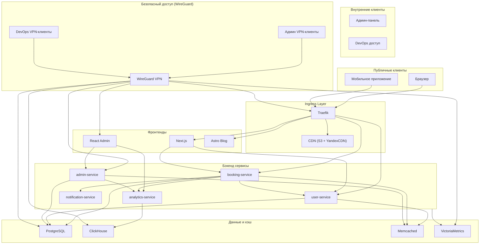

# Архитектура системы

## Обзор

Cleaning Booking System - микросервисное приложение для бронирования клининговых услуг. Система построена на современных технологиях с акцентом на масштабируемость и безопасность.

## Компоненты

### Фронтенд

- **Next.js** - основное приложение для клиентов
- **React** - панель администратора
- **Astro** - маркетинговый блог

### Бэкенд (Go микросервисы)

- **booking-service** - управление бронированиями
- **user-service** - пользователи и аутентификация
- **notification-service** - уведомления
- **analytics-service** - аналитика и отчеты

### Инфраструктура

- **Kubernetes** - оркестрация контейнеров
- **PostgreSQL** - основная база данных
- **Redis/Memcached** - кэширование
- **Traefik** - API gateway
- **WireGuard VPN** - безопасный доступ

## Схема взаимодействия

## Ключевые особенности

- **Микросервисная архитектура** - независимое масштабирование компонентов
- **Безопасность** - JWT аутентификация, VPN для админки
- **Мониторинг** - централизованные логи и метрики
- **CI/CD** - автоматизированное тестирование и деплой
